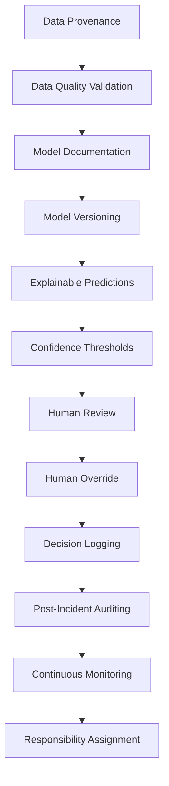

# Ethical case study

When AI recommends which flood-affected areas receive scarce resources first, data providers, developers, organizations and human authorities can each contribute to an error. If their duties and decisions are not recorded, responsibility becomes difficult to investigate. The central question is: who is responsible if the AI-assisted allocation is wrong?

DEMO-FLOOD-01 is a fictional urban flood affecting twelve named areas. The default budget is five rescue teams, ten ambulances, twenty medical supply units and thirty food/shelter units. Riverside has the highest baseline model score, but model correctness and sufficient assistance cannot be inferred from ranking alone.

In the executed missing-vulnerability scenario, Lake Colony's score changes from 53.35 to 51.93; its rank changes from 5 to 6 and it loses one rescue team. Outer Settlement changes from rank 7 to 4 and gains one team. Median imputation can increase or decrease scores, depending on the missing value's relation to the training median. These are real computed changes, not predetermined predictions.

There are no newly missed high-severity areas in this small demonstration incident under the five scenarios. We report that result openly. The held-out test nevertheless has 26 truly High/Critical records predicted below High, demonstrating model error independently of the demo. Allocation changes indicate possible harm, not observed injuries or deaths.

The primary issue is an accountability gap: an organization may defer to a provider, a provider may defer to a developer, and a coordinator may defer to the model, leaving affected people without an answer. Automation bias can convert a recommendation into an unexamined decision. Poor coverage, delayed calls, correlated features and insufficient testing can redistribute scarce assistance. Transparency and auditability help investigators identify the facts, but do not by themselves ensure fair allocation.

Ethical accountability is the obligation to justify decisions, answer questions and support remedy. Technical responsibility concerns model/data/interface engineering. Organizational responsibility concerns procurement, training, deployment and monitoring. Legal liability requires applicable laws and specific facts; this project provides no legal finding. Failure is evaluated as a chain of shared responsibilities, with evidence before blame.

| Failure/Event | Stakeholder(s) | Type of Responsibility | Preventive Measure |
| --- | --- | --- | --- |
| Missing or delayed data | Data Provider + Disaster Management Organization | Data / organizational | Provenance, freshness checks, field confirmation |
| Poor model design | AI Developer + AI/System Provider | Technical / ethical | Leakage checks, evaluation, limitations disclosure |
| Insufficient scenario validation | AI Developer + Disaster Management Organization | Technical / organizational | Pre-deployment scenario and group tests |
| Unreliable deployment | AI/System Provider + Disaster Management Organization | Organizational / technical | Safe defaults, access controls, incident response |
| Blindly accepting recommendations | Human Emergency Coordinator + Disaster Management Organization | Operational / ethical | Training, evidence review, justified sign-off |
| Inappropriate final allocation | Final Decision Authority + Human Emergency Coordinator | Decision / ethical | Budget checks, local evidence, independent review |
| Missing audit records | AI/System Provider + Disaster Management Organization | Governance / technical | Append-only history, backups, integrity checks |
| Model or data drift | AI Developer + Disaster Management Organization | Monitoring / organizational | Periodic validation, drift alerts, suspend use |

| Ethical principle | System feature |
| --- | --- |
| Accountability | Versioned recommendations and named synthetic sign-off |
| Transparency | Input snapshots, scoring formula and documented limitations |
| Human Oversight | All final portfolios require coordinator and authority confirmation |
| Fairness | Synthetic group miss rates and data-quality scenario comparisons |
| Data Responsibility | Schema/range validation, provenance and missing-data flags |
| Reliability | Incident-disjoint validation/test metrics and automated tests |
| Explainability | Signed local SHAP contributions with output units |
| Auditability | Linked recommendation/review events, JSON export and hash checking |

## Investigator questions

Was the source complete and current? Were ranges and coverage validated? Was rare severe-case recall sufficient? Did the organization test corrupted-data conditions? Did the coordinator have time and local evidence? Did the authority authorize the final portfolio? Is the recommendation distinct from the decision? Check the retained input snapshot, explanation units, versions and review event before attributing responsibility.

Require data provenance and freshness indicators, validate missing and implausible observations, evaluate rare severe cases and undercovered areas, and make model limits visible. Give reviewers time, local information and authority to challenge recommendations. Separate AI advice from human authorization and preserve override reasons. Review data/model/organization/human contributions jointly after incidents, with avenues for correction and remedy. Assign owners for monitoring, backups and data contracts. Suspend use when evidence quality or validation becomes inadequate.

1. NIST (2023). *Artificial Intelligence Risk Management Framework (AI RMF 1.0)*. [Official publication](https://nvlpubs.nist.gov/nistpubs/ai/NIST.AI.100-1.pdf). Governance, context, measurement and risk management inform our responsibility framework.
2. UNESCO (2021). *Recommendation on the Ethics of Artificial Intelligence*. [Official recommendation](https://www.unesco.org/en/legal-affairs/recommendation-ethics-artificial-intelligence). Human oversight, transparency and accountability inform the safeguards.
3. Lundberg, S. M., and Lee, S.-I. (2017). *A Unified Approach to Interpreting Model Predictions*. [Original paper](https://arxiv.org/abs/1705.07874). Basis for SHAP attribution.
4. UNDRR. *Data strategy and roadmap 2023–2027*. [Official strategy](https://www.undrr.org/data-strategy-and-roadmap-2023-2027). Context for disaster data governance; this project does not reproduce a UNDRR operational system.
5. scikit-learn. [Classification metrics](https://scikit-learn.org/stable/modules/generated/sklearn.metrics.classification_report.html) and [GroupShuffleSplit](https://scikit-learn.org/stable/modules/generated/sklearn.model_selection.GroupShuffleSplit.html). Implementation references.
6. SHAP. [LinearExplainer](https://shap.readthedocs.io/en/latest/generated/shap.LinearExplainer.html) and [TreeExplainer](https://shap.readthedocs.io/en/latest/generated/shap.TreeExplainer.html). Explainability implementation.
7. Streamlit. [App testing](https://docs.streamlit.io/develop/api-reference/app-testing). Interface verification.

Sources accessed 7 October 2026. Ethical sources guide the design; they do not validate the synthetic simulator, score anchors or allocation policy.
