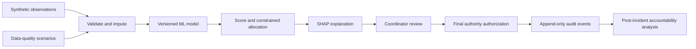

# System architecture




```text
app.py                         ten dashboard workspaces
requirements.txt               pinned verified Python libraries
.streamlit/config.toml         dashboard theme/server settings
src/                           data, ML, explanation, allocation, scenarios, audit
scripts/                       results, documentation and verification commands
data/raw/                      3,000-row dataset and complete demo incident
data/processed/                incident-disjoint split manifest
models/                        selected and underrepresentation model bundles
logs/                          local append-only SQLite audit (created at runtime)
reports/                       report, metrics, CSV outputs, figures and verification
presentation/                  15-slide outline and six-minute demonstration script
docs/                          architecture, data/model cards, ethics and 60 viva answers
tests/                         model, data, allocation, simulation, audit and UI tests
```

Required features are explicitly allowlisted and checked for finite values, valid categories and physical ranges. NaN is allowed and imputed inside the fitted pipeline. Numeric medians and StandardScaler parameters come only from the 1,800 training rows; categorical values use most-frequent imputation and OneHotEncoder. Validation and test each contain 600 rows. GroupShuffleSplit keeps every incident wholly inside one split, preventing same-incident leakage; recurring area types remain across splits, so the evaluation is not an unseen-city test. IDs, true severity, labels and response time are excluded from model inputs. Label-driven selection or post-event outcomes are never input features.

SQLite stores recommendation events and linked review events. Every recommendation includes decision/incident/area IDs, timestamp, model and data versions, dataset SHA-256, original input record ID, full input snapshot and its hash, predicted class, score, confidence, leading explanation features, resource recommendation, mandatory-review flag, scenario, budget, threshold and pending reviewer/final fields. Review events add synthetic reviewer, decision, override flag/reason, final allocation, authority and review time. The merged audit view answers what the AI advised, what evidence it used and how a human changed it.

Stable context IDs make reruns idempotent. SQLite transactions enforce whole-portfolio review; triggers reject event updates/deletions. SHA-256 chains detect local alterations and JSON exports allow investigation. The local database owner can rewrite the journal and its hashes; no external anchor, authentication, retention policy or backup automation is implemented. Joblib files must be project-generated and trusted; untrusted model uploads are unsupported. Model version identifies this dataset/configuration release, not an independent cryptographic signature of every source-file change. Changing implementation requires a deliberate new version.

Training: `python -m src.train` → results: `python -m scripts.build_results` → documentation: `python -m scripts.build_docs` → tests: `python -m pytest -q` → dashboard: `python -m streamlit run app.py`. Regenerate reports after retraining. To preserve a prior release, archive its artifacts and audit database before deliberate version changes.
