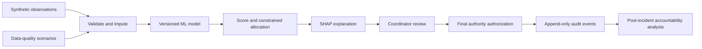
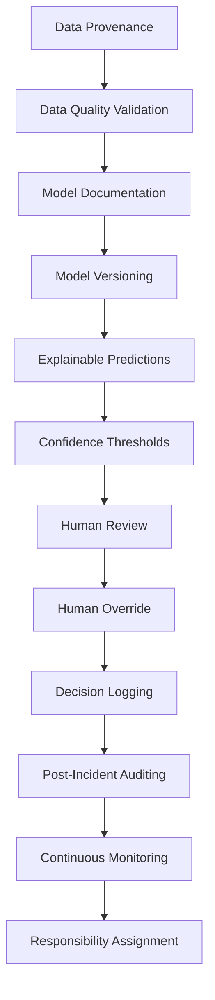
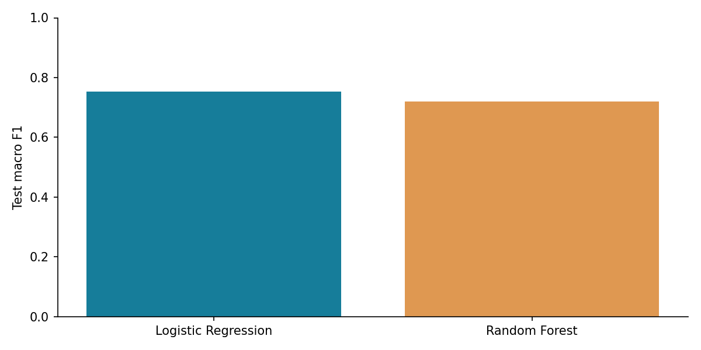
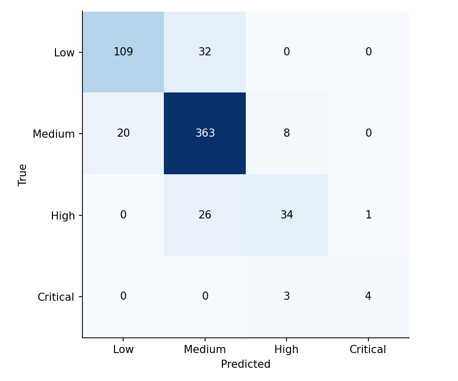
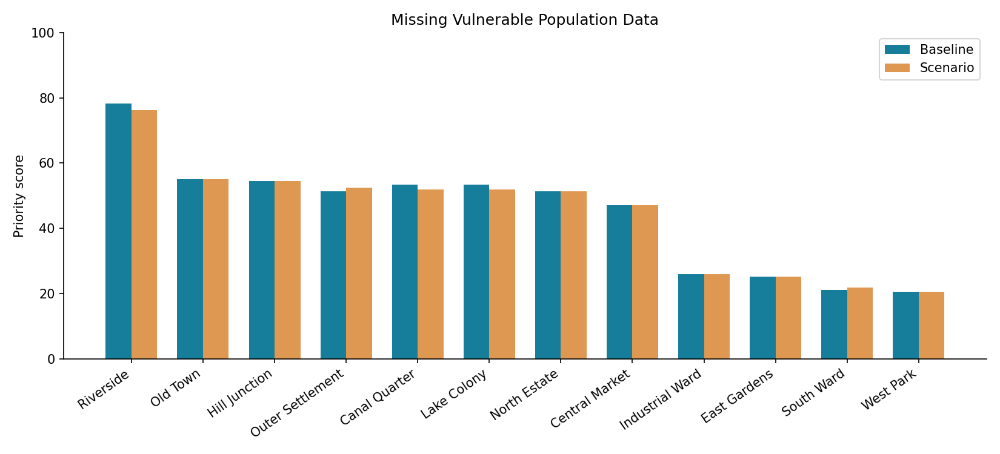
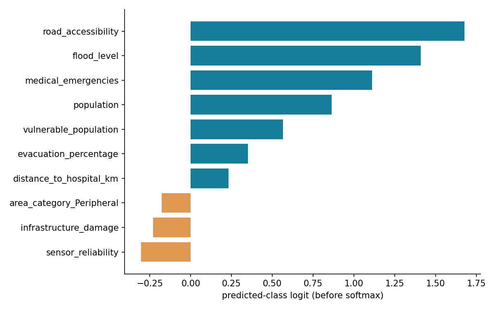

# Algorithmic Accountability: A Case Study on AI-Based Disaster Response and Emergency Resource Allocation

Subject: Ethics in Artificial Intelligence & Data Science

Academic simulation only. All results below are generated by this repository.

## 1. Introduction

This mini-project examines AI-assisted allocation as an ethics and accountability case study. It implements the entire evidence chain from observations to authorized decisions and post-incident scrutiny.

## 2. Problem Definition

When AI recommends which flood-affected areas receive scarce resources first, data providers, developers, organizations and human authorities can each contribute to an error. If their duties and decisions are not recorded, responsibility becomes difficult to investigate. The central question is: who is responsible if the AI-assisted allocation is wrong?

## 3. Objectives

Implement reproducible ML; expose data-quality consequences; conserve scarce resources; explain predictions; require human approval; preserve decision evidence; map shared stakeholder duties without deciding legal liability.

## 4. Background / Context

NIST AI RMF 1.0 organizes responsible-AI risk work through governance, context, measurement and management [1]. UNESCO's recommendation emphasizes oversight and accountability [2]. UNDRR's data strategy provides disaster-data governance context [4]. This project applies those ideas in a limited teaching simulation; it is an allocation study rather than flood forecasting.

## 5. Case Study

DEMO-FLOOD-01 is a fictional urban flood affecting twelve named areas. The default budget is five rescue teams, ten ambulances, twenty medical supply units and thirty food/shelter units. Riverside has the highest baseline model score, but model correctness and sufficient assistance cannot be inferred from ranking alone.

In the executed missing-vulnerability scenario, Lake Colony's score changes from 53.35 to 51.93; its rank changes from 5 to 6 and it loses one rescue team. Outer Settlement changes from rank 7 to 4 and gains one team. Median imputation can increase or decrease scores, depending on the missing value's relation to the training median. These are real computed changes, not predetermined predictions.

There are no newly missed high-severity areas in this small demonstration incident under the five scenarios. We report that result openly. The held-out test nevertheless has 26 truly High/Critical records predicted below High, demonstrating model error independently of the demo. Allocation changes indicate possible harm, not observed injuries or deaths.

## 6. Ethical Issue Identification

The primary issue is an accountability gap: an organization may defer to a provider, a provider may defer to a developer, and a coordinator may defer to the model, leaving affected people without an answer. Automation bias can convert a recommendation into an unexamined decision. Poor coverage, delayed calls, correlated features and insufficient testing can redistribute scarce assistance. Transparency and auditability help investigators identify the facts, but do not by themselves ensure fair allocation.

Ethical accountability is the obligation to justify decisions, answer questions and support remedy. Technical responsibility concerns model/data/interface engineering. Organizational responsibility concerns procurement, training, deployment and monitoring. Legal liability requires applicable laws and specific facts; this project provides no legal finding. Failure is evaluated as a chain of shared responsibilities, with evidence before blame.

## 7. Relevant Ethical Principles

| Ethical principle | System feature |
| --- | --- |
| Accountability | Versioned recommendations and named synthetic sign-off |
| Transparency | Input snapshots, scoring formula and documented limitations |
| Human Oversight | All final portfolios require coordinator and authority confirmation |
| Fairness | Synthetic group miss rates and data-quality scenario comparisons |
| Data Responsibility | Schema/range validation, provenance and missing-data flags |
| Reliability | Incident-disjoint validation/test metrics and automated tests |
| Explainability | Signed local SHAP contributions with output units |
| Auditability | Linked recommendation/review events, JSON export and hash checking |

## 8. Dataset

The dataset has 3,000 synthetic area-incident records, 250 incidents and twelve recurring area identifiers. NumPy seed 42 fixes generation; the separate complete demo uses seed 2026. No patient, citizen or actual disaster data is used. Columns include flood depth (m), rainfall (mm), population, density (people/km²), calls, accessibility (0–1), distance (km), vulnerable-population fraction (0–1), hospital beds, local resources, medical emergencies, infrastructure damage (0–1), evacuation fraction, historical severity, reliability and diagnostic response time. `true_severity` is a noisy latent simulator value, and `priority_label` bins it at 40, 70 and 85. These thresholds are academic assumptions, not clinical standards.

Flood intensity, vulnerable population, response difficulty and damage generally increase latent need; evacuation generally reduces it. Population and medical demand contribute, and Gaussian noise represents omitted conditions. Observations are correlated; no causal inference is claimed. Approximately 2.5% missingness is introduced independently in three training-data fields. The complete demonstration omits that random missingness to establish a clean comparison. Ground-truth severity is never recomputed after observational corruption.

## 9. Data Preparation

Required features are explicitly allowlisted and checked for finite values, valid categories and physical ranges. NaN is allowed and imputed inside the fitted pipeline. Numeric medians and StandardScaler parameters come only from the 1,800 training rows; categorical values use most-frequent imputation and OneHotEncoder. Validation and test each contain 600 rows. GroupShuffleSplit keeps every incident wholly inside one split, preventing same-incident leakage; recurring area types remain across splits, so the evaluation is not an unseen-city test. IDs, true severity, labels and response time are excluded from model inputs. Label-driven selection or post-event outcomes are never input features.

## 10. Methodology and Analysis

Four-class severity classification supports uncertainty through predicted probabilities. Logistic Regression and Random Forest are fitted on the same training split. Validation macro F1 selects the final model before test evaluation. Neither model is refitted on the test data. Random Forest uses 180 trees, minimum leaf size three and 80% feature sampling; Logistic Regression uses C=1 and a 1,500-iteration limit. Hyperparameter search was deliberately omitted to keep the experiment understandable.

Emergency score = 20·P(Low) + 55·P(Medium) + 77·P(High) + 95·P(Critical). These within-band anchors are a transparent project decision layer. Scores lie within 0–100 (the expected anchors practically span 20–95). Score bands are Low <40, Medium <70, High <85, Critical ≥85. The most probable model class and score band can differ; neither is silently substituted for the other.

Resource quotas are proportional to score, then integer counts are assigned by largest remainders. Ties follow stable rank and area ID. The algorithm conserves each resource budget. Zero-score portfolios use equal weights. Allocation does not optimize travel, actual demand, team capability, hospital congestion or predicted lives saved. Available local teams/ambulances are context features rather than deductions from the new centrally supplied resource budget.

## 11. ML Model

| Model | Validation macro F1 | Test accuracy | Test precision (macro) | Test recall (macro) | Test macro F1 | Test ROC-AUC (OvR macro) |
| --- | --- | --- | --- | --- | --- | --- |
| Logistic Regression | 0.7895 | 0.8500 | 0.8157 | 0.7076 | 0.7524 | 0.9627 |
| Random Forest | 0.7615 | 0.8383 | 0.8609 | 0.6508 | 0.7196 | 0.9548 |

Validation-selected winner: Logistic Regression. Selection favors validation macro F1 over aggregate accuracy; test metrics are reported after selection. Full class reports and matrices are in metrics.json.

## 12. Explainable AI

The selected Logistic Regression uses SHAP LinearExplainer on transformed features and a training-only background. Contributions explain the predicted class logit before softmax: positive values support that class, negative values oppose it. They are not priority-score points or calibrated probabilities. Random Forest support uses TreeExplainer and predicted-class probability units. Numeric transformed names remain recognizable; encoded area-category contributions appear separately.

For every recommendation, the audit stores the leading six actual contributions and their method/units. The XAI page shows the full table, signed chart, base value and reconstructed output. An automated test checks base plus all contributions equals the model output. Global unsigned model importance is an explicit fallback for supported SHAP failures; it is never presented as signed local attribution. SHAP worked in this execution. Correlated predictors and background choice limit attribution interpretation; explanation does not prove causation, correctness or fairness.

## 13. Accountability Framework

1. Data Provenance
2. Data Quality Validation
3. Model Documentation
4. Model Versioning
5. Explainable Predictions
6. Confidence Thresholds
7. Human Review
8. Human Override
9. Decision Logging
10. Post-Incident Auditing
11. Continuous Monitoring
12. Responsibility Assignment

SQLite stores recommendation events and linked review events. Every recommendation includes decision/incident/area IDs, timestamp, model and data versions, dataset SHA-256, original input record ID, full input snapshot and its hash, predicted class, score, confidence, leading explanation features, resource recommendation, mandatory-review flag, scenario, budget, threshold and pending reviewer/final fields. Review events add synthetic reviewer, decision, override flag/reason, final allocation, authority and review time. The merged audit view answers what the AI advised, what evidence it used and how a human changed it.

Stable context IDs make reruns idempotent. SQLite transactions enforce whole-portfolio review; triggers reject event updates/deletions. SHA-256 chains detect local alterations and JSON exports allow investigation. The local database owner can rewrite the journal and its hashes; no external anchor, authentication, retention policy or backup automation is implemented. Joblib files must be project-generated and trusted; untrusted model uploads are unsupported. Model version identifies this dataset/configuration release, not an independent cryptographic signature of every source-file change. Changing implementation requires a deliberate new version.

| Failure/Event | Stakeholder(s) | Type of Responsibility | Preventive Measure |
| --- | --- | --- | --- |
| Missing or delayed data | Data Provider + Disaster Management Organization | Data / organizational | Provenance, freshness checks, field confirmation |
| Poor model design | AI Developer + AI/System Provider | Technical / ethical | Leakage checks, evaluation, limitations disclosure |
| Insufficient scenario validation | AI Developer + Disaster Management Organization | Technical / organizational | Pre-deployment scenario and group tests |
| Unreliable deployment | AI/System Provider + Disaster Management Organization | Organizational / technical | Safe defaults, access controls, incident response |
| Blindly accepting recommendations | Human Emergency Coordinator + Disaster Management Organization | Operational / ethical | Training, evidence review, justified sign-off |
| Inappropriate final allocation | Final Decision Authority + Human Emergency Coordinator | Decision / ethical | Budget checks, local evidence, independent review |
| Missing audit records | AI/System Provider + Disaster Management Organization | Governance / technical | Append-only history, backups, integrity checks |
| Model or data drift | AI Developer + Disaster Management Organization | Monitoring / organizational | Periodic validation, drift alerts, suspend use |

**Data Provider:** Document collection coverage, sensor reliability, timeliness and missing values; correct reported errors.

**AI Developer:** Choose defensible targets and models, prevent leakage, evaluate uncertainty and group limitations, version releases.

**AI/System Provider:** Deliver reliable interfaces, preserve model provenance and audit records, disclose unsupported uses.

**Disaster Management Organization:** Validate suitability, resource policies and data contracts; train reviewers and monitor incidents.

**Human Emergency Coordinator:** Inspect recommendations and local evidence, recognize automation bias and justify overrides.

**Final Decision Authority:** Authorize the complete constrained plan and remain answerable for its operational justification.

The **Project-Defined Accountability Readiness Score** averages seven equally weighted binary dimensions (0 or 100): working SHAP for all active records; complete current human sign-off; complete audit records plus valid hash chain; no missing input fields and sensor reliability ≥0.7; High test recall ≥80% plus at least thirty Critical test examples; report file existence; sustained monitoring. The reliability dimension fails here; monitoring also remains zero because deployment monitoring is absent. With complete inputs and the report present, a pending baseline portfolio scores 57.14/100; after full review it scores 71.43/100. These values follow the executed conditions and formula, and the dashboard recomputes them. A stale but nonmissing call count can pass this limited data-quality check; that limitation is explicit. It is a teaching checklist, not a legal or international standard, and no score certifies operational safety.

## 14. Human Oversight

Every recommendation is pending until the complete portfolio receives explicit sign-off. Confidence is the largest class probability, not a certified uncertainty bound. The configurable default threshold is 70%; low confidence, any missing features or sensor reliability below 0.7 flag mandatory review. Higher confidence still requires human authorization.

Human Review allows integer resource edits for every area. A changed plan requires a meaningful reason of at least eight characters, complete-area coverage, nonnegative integer counts and totals within every budget. Reviewer and authority are selected only from synthetic aliases. A confirmation checkbox records that evidence and flags were reviewed. All twelve review events are committed atomically; rejected plans leave every decision pending. Accepted recommendations and overrides remain distinguishable. A reviewed context cannot be reviewed twice; a new scenario/budget/threshold creates a separate context, while baseline data remains fixed. This demonstrates oversight, but aliases are not authentication, and a checkbox cannot prove a human thoughtfully reviewed evidence.

## 15. Ethical Risk Simulation

1. Complete Data: unchanged observation and final selected model.
2. Missing Vulnerable Population Data: all peripheral-area vulnerability observations become NaN; trained medians handle them.
3. Delayed Emergency Call Data: peripheral calls retain 20% of current counts and medical reports retain 35%, representing a joint reporting delay.
4. Noisy Sensor Data: fixed-seed perturbations change flood depth and rainfall within physical bounds; reliability becomes 0.4.
5. Underrepresented Area Data: retain only the first 10% of peripheral training records in an alternate fitted model, plus missing vulnerability and halved peripheral calls in demo inputs. Validation and test never become training data. This deliberately combines training and observation disadvantages and does not isolate either causal effect.

Each scenario reruns inference and allocation, compares against complete-data baseline with the same budget, and preserves true need. Measures include score differences, rank differences (positive means deterioration), half the absolute resource-count differences (units reassigned), false High/Critical predictions, missed High/Critical reference areas, high-severity areas without rescue, confidence and missing cells. Scenario exports and PNG/interactive HTML charts are produced by actual execution.

## 16. Results / Findings

| Model | Validation macro F1 | Test accuracy | Test precision (macro) | Test recall (macro) | Test macro F1 | Test ROC-AUC (OvR macro) |
| --- | --- | --- | --- | --- | --- | --- |
| Logistic Regression | 0.7895 | 0.8500 | 0.8157 | 0.7076 | 0.7524 | 0.9627 |
| Random Forest | 0.7615 | 0.8383 | 0.8609 | 0.6508 | 0.7196 | 0.9548 |

| scenario | mean_absolute_score_change | changed_ranks | rescue_units_reassigned | missed_high_severity_areas | false_high_prioritizations | high_severity_without_rescue | mean_confidence | missing_feature_cells |
| --- | --- | --- | --- | --- | --- | --- | --- | --- |
| Complete Data | 0.0000 | 0 | 0 | 0 | 0 | 0 | 0.9148 | 0 |
| Missing Vulnerable Population Data | 0.5744 | 4 | 1 | 0 | 0 | 0 | 0.9108 | 5 |
| Delayed Emergency Call Data | 1.1275 | 0 | 0 | 0 | 0 | 0 | 0.8879 | 0 |
| Noisy Sensor Data | 5.3151 | 9 | 2 | 0 | 0 | 0 | 0.7949 | 0 |
| Underrepresented Area Data | 1.0365 | 4 | 1 | 0 | 0 | 0 | 0.9083 | 5 |

Selected: Logistic Regression. Accuracy 85.00%, macro precision 0.8157, macro recall 0.7076, macro F1 0.7524, OvR macro ROC-AUC 0.9627. High recall is 55.74%; Critical recall is 57.14% on only 7 Critical test examples. Class imbalance makes aggregate accuracy insufficient. Multi-class Brier score is 0.2126; probabilities have not been independently calibrated.

DEMO-FLOOD-01 is a fictional urban flood affecting twelve named areas. The default budget is five rescue teams, ten ambulances, twenty medical supply units and thirty food/shelter units. Riverside has the highest baseline model score, but model correctness and sufficient assistance cannot be inferred from ranking alone.

In the executed missing-vulnerability scenario, Lake Colony's score changes from 53.35 to 51.93; its rank changes from 5 to 6 and it loses one rescue team. Outer Settlement changes from rank 7 to 4 and gains one team. Median imputation can increase or decrease scores, depending on the missing value's relation to the training median. These are real computed changes, not predetermined predictions.

There are no newly missed high-severity areas in this small demonstration incident under the five scenarios. We report that result openly. The held-out test nevertheless has 26 truly High/Critical records predicted below High, demonstrating model error independently of the demo. Allocation changes indicate possible harm, not observed injuries or deaths.

| area_category | n | high_severity_n | miss_rate_high | mean_score | mean_rescue_teams | interpretation |
| --- | --- | --- | --- | --- | --- | --- |
| Central | 150 | 15 | 0.4000 | 47.4377 | 0.3267 | Descriptive only; small group |
| Peripheral | 250 | 33 | 0.3636 | 51.6422 | 0.5320 | Synthetic group diagnostic |
| Residential | 200 | 20 | 0.4000 | 47.7973 | 0.3400 | Descriptive only; small group |

Group miss rates condition on true High/Critical need. Groups with fewer than thirty high-severity cases are explicitly flagged; no population fairness, causal disparity or demographic claim follows from these synthetic groups. Unequal mean allocations may reflect unequal modeled need and cannot alone establish unfairness.

## 17. Proposed Solution / Recommendations

Require data provenance and freshness indicators, validate missing and implausible observations, evaluate rare severe cases and undercovered areas, and make model limits visible. Give reviewers time, local information and authority to challenge recommendations. Separate AI advice from human authorization and preserve override reasons. Review data/model/organization/human contributions jointly after incidents, with avenues for correction and remedy. Assign owners for monitoring, backups and data contracts. Suspend use when evidence quality or validation becomes inadequate.

## 18. Limitations

Synthetic labels encode designer assumptions and omit many social, geographic and logistical variables. Only one fixed split and one generator are evaluated; generalization to actual cities is unknown. Seven Critical test examples provide weak evidence. No independently calibrated uncertainty, temporal freshness metadata, validated harm estimates or routing optimization is available. The underrepresentation experiment is confounded by intentional input corruption. Twelve-area comparisons are descriptive, and synthetic area categories are not protected demographics. Local aliases and hash checking are academic mechanisms, not secure organizational identity or tamper-proof storage. Review confirmation cannot eliminate automation bias. This system must not guide real emergencies.

## 19. Future Scope

With appropriate permissions and governance, use representative event-disjoint and temporal external validation, stronger severe-case support, calibrated probabilities, timestamps for source freshness, logistics-aware constrained allocation, uncertainty-sensitive escalation, authenticated reviewer roles, external audit anchoring, disaster recovery, drift monitoring and stakeholder participation. Evaluate resulting policy choices with emergency professionals before any operational consideration.

## 20. Conclusion

The executed experiments show how incomplete observations can change resource allocations even when the affected area does not cross a severity class boundary. High overall accuracy coexists with missed severe records. Explanations, review gates and traceable evidence make distributed responsibility investigable, while meaningful oversight and governance remain human and organizational duties.

## 21. References

1. NIST (2023). *Artificial Intelligence Risk Management Framework (AI RMF 1.0)*. [Official publication](https://nvlpubs.nist.gov/nistpubs/ai/NIST.AI.100-1.pdf). Governance, context, measurement and risk management inform our responsibility framework.
2. UNESCO (2021). *Recommendation on the Ethics of Artificial Intelligence*. [Official recommendation](https://www.unesco.org/en/legal-affairs/recommendation-ethics-artificial-intelligence). Human oversight, transparency and accountability inform the safeguards.
3. Lundberg, S. M., and Lee, S.-I. (2017). *A Unified Approach to Interpreting Model Predictions*. [Original paper](https://arxiv.org/abs/1705.07874). Basis for SHAP attribution.
4. UNDRR. *Data strategy and roadmap 2023–2027*. [Official strategy](https://www.undrr.org/data-strategy-and-roadmap-2023-2027). Context for disaster data governance; this project does not reproduce a UNDRR operational system.
5. scikit-learn. [Classification metrics](https://scikit-learn.org/stable/modules/generated/sklearn.metrics.classification_report.html) and [GroupShuffleSplit](https://scikit-learn.org/stable/modules/generated/sklearn.model_selection.GroupShuffleSplit.html). Implementation references.
6. SHAP. [LinearExplainer](https://shap.readthedocs.io/en/latest/generated/shap.LinearExplainer.html) and [TreeExplainer](https://shap.readthedocs.io/en/latest/generated/shap.TreeExplainer.html). Explainability implementation.
7. Streamlit. [App testing](https://docs.streamlit.io/develop/api-reference/app-testing). Interface verification.

Sources accessed 7 October 2026. Ethical sources guide the design; they do not validate the synthetic simulator, score anchors or allocation policy.
